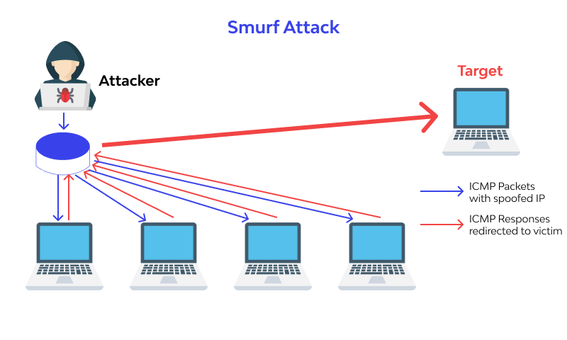

# Use for educational purposes only!
This program is a stress tester
use at your own risk
The author is not responsible, the program uses the MIT license.

# Main


## Description

This is a smurf attack program developed in Go. It is designed for attacking network load by sending data packets over ICMP(type:Echo). The program uses several libraries to process packets, interact with the network, and generate random data.


### Important Note
For the program to work correctly, you need to install **Npcap**. Without it, the program may not work properly.

You can download **Npcap** from the [official Npcap website](https://nmap.org/npcap/).

## Dependencies

Before running the program, make sure you have installed the following dependencies:

- **`golang.org/x/sys/windows`** — for working with the Windows API.
- Go standard libraries:
  - `bufio`
  - `bytes`
  - `encoding/binary`
  - `fmt`
  - `log`
  - `math/rand`
  - `net`
  - `os`
  - `strconv`
  - `strings`
  - `time`

To install the `golang.org/x/sys/windows` dependency, use the following command:

```cmd
go get golang.org/x/sys/windows
```
Also, make sure you have Npcap installed. You can download and install it from the official Npcap website.

How to Run
Clone the repository:

```git
git clone https://github.com/Batcherss/goSmurfAttack.git
```

Enter the folder:
```cmd
cd goSmurfAttack
```

Install the necessary dependencies (if not already installed):
```cmd
go mod tidy
```

Run the program:
```cmd
go run main.go
```

Or you can just start
```
cmd.bat
```
that will automatic start the main.go
# How it works?


A smurf attack is a type of distributed denial-of-service (DDoS) attack in which an attacker exploits a network protocol to flood a target system with traffic, overwhelming it. Here's how it works:
1. Spoofing the Source Address: The attacker sends a ping request (ICMP Echo Request) to a network's broadcast address, but with the source IP address spoofed to be that of the target system.
2. Amplification: When the broadcast address receives the ping request, it replies to all devices on the network. Each device sends a ping response (ICMP Echo Reply) to the target IP address, which is spoofed by the attacker.
3. Flooding the Target: As a result, the target system is bombarded with a large number of ping replies from all devices on the network, consuming its bandwidth and potentially causing it to become unresponsive or crash.
This type of attack leverages the amplification of the broadcast address to increase the volume of traffic directed at the target, making it more damaging with fewer resources required from the attacker.

# How to use
- Set it up:
  - `src ip: (Enter here victim ip)`
  - `packet size: (There's packet size of sending icmp , preferably up to 1000 bytes)`
  - `num. of req.: (Number of requests (from 100 to 200 average for routes)`

# Notes
Make sure you have administrator rights to work with network packets.
The program uses Npcap, so be sure to install it before running the program, otherwise, it may not work correctly.

